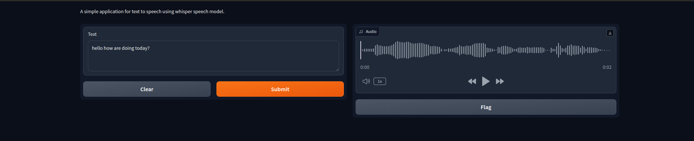

<div align="center">

# Text to Speech with Gradio

[](https://github.com/pre-commit/pre-commit)
[](https://pytorch.org/get-started/locally/)


This is a simple example of how to infer text to speech using a pre-trained model with Gradio.
</div>

## 📌 Feature
- [x] Gradio UI implemented
- [x] Whisper-Speech model used
- [x] Dockerized
- [x] Moduler code
- [ ] MetaVoice Src Model implementation
- [ ] Tortoise TTS Model implementation

## 📁  Project Structure
The directory structure of new project looks like this:

```
├── configs
│   └── config.toml
├── main.py
├── pylogger
│   ├── __init__.py
│   ├── logger.py
├── README.md
├── requirements.txt
├── src
│   ├── app.py
│   ├── core
│   │   ├── __init__.py
│   │   └── whisperSpeech.py
│   ├── __init__.py
│   ├── server
│   │   ├── __init__.py
│   │   └── serve.py
│   └── utils
│       ├── config.py
│       ├── __init__.py
│       ├── logger.py
│       ├── models.py
│       └── textformat.py
└── tts-data
    
```

## 🚀 Getting Started

### Step 1: Clone the repository
```bash
git clone https://github.com/sh-aidev/text-to-speech-inference.git
cd text-to-speech-inference
```

### Step 2: Open inside docker container in vscode

```bash
code .
```
**NOTE**: Once repo in opened in vscode, it will ask to open in container. Click on reopen in container. It will take some time to build the container.

### Step 3: Install the required dependencies

```bash
python3 -m pip install -r requirements.txt
```

### Step 4: Run the server

```bash
python3 main.py
```

## 📝  Usage Example Page:
- Open the browser and go to `http://localhost:8080/` to see the Gradio UI.
- Enter the text in the text box and click on the `Speak` button to hear the audio.




## 📜  References
- [Gradio](https://gradio.app/)
- [Whisper-Speech](https://github.com/collabora/WhisperSpeech.git)
- [MetaVoice-src](https://github.com/metavoiceio/metavoice-src.git)
- [Tortoise-TTS](https://github.com/neonbjb/tortoise-tts.git)
- [PyTorch](https://pytorch.org/)
- [Docker](https://www.docker.com/)
